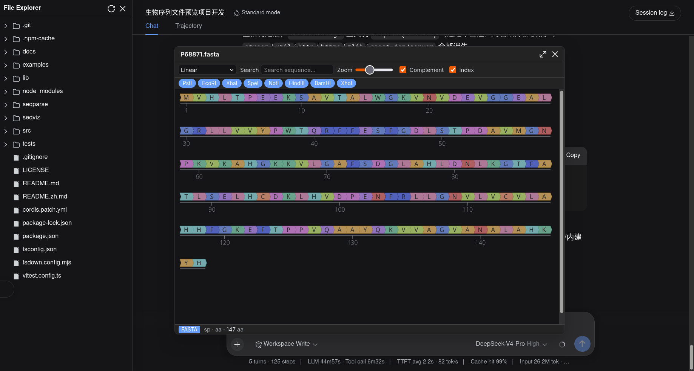
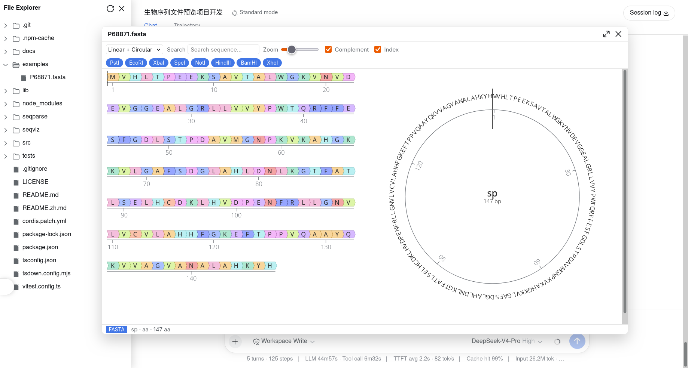

# dsh-file-explorer-preview-sequence

[中文](README.zh.md) | English

A [DSH Web](https://deepseek.com) plugin that adds a **SeqViz sequence viewer** to [dsh-file-explorer](https://github.com/wolfsonliu/dsh-file-explorer), overriding its plain-text previews for **FASTA**, **GenBank**, **JBEI**, **SnapGene**, and **SBOL** files.

Select a `.gb` / `.fasta` (or any supported format below) in the file explorer and the preview panel renders an interactive sequence viewer instead of raw text.

## Screenshots

| Dark theme | Light theme |
| --- | --- |
|  |  |

## Features

- **Interactive viewer** built on [`seqviz`](https://github.com/Lattice-Automation/seqviz) (`<SeqViz>`), with parsing by [`seqparse`](https://github.com/Lattice-Automation/seqparse).
- **Topologies**: circular / linear / both / both-flip.
- **Feature annotations** with colors, **search** with highlight, **enzyme cut sites**, complement & index toggles, and linear zoom.
- **Status bar** with the format badge, name, sequence type, and length.
- **Localized** toolbar/status copy (中文 / English).
- **Dark/light aware**: follows DSH's `data-ds-dark-theme`.

## Supported formats

| Extension | Format |
|-----------|--------|
| `fasta` `fa` `fas` `fna` `faa` `ffn` | FASTA |
| `gb` `gbk` `genbank` `gp` | GenBank / GenPept |
| `dna` | SnapGene |
| `seq` | JBEI SEQ |
| `sbol` `xml` | SBOL v1/v2 |

## Install

### From the Git repository

```sh
dsh plugin --profile web add github:wolfsonliu/dsh-file-explorer-preview-sequence
dsh web
```

### From source

```sh
git clone https://github.com/wolfsonliu/dsh-file-explorer-preview-sequence
cd dsh-file-explorer-preview-sequence
npm install
npm run build
dsh plugin --profile web add .
dsh web
```

## Dependencies

This plugin **requires** [`@dsh-external/dsh-file-explorer`](https://github.com/wolfsonliu/dsh-file-explorer) (v0.1.0+) — it injects the `fileExplorer` cordis service (`registerPreview` / `writeFile` / `readRawFile`). Install and enable `dsh-file-explorer` before this plugin:

```sh
# install the core from git
dsh plugin --profile web add github:wolfsonliu/dsh-file-explorer

# or, from source
git clone https://github.com/wolfsonliu/dsh-file-explorer
cd dsh-file-explorer
npm install && npm run build
dsh plugin --profile web add .
```

> For local development, this repo's `devDependencies` resolves `@dsh-external/dsh-file-explorer`'s `./client` type definitions. Point it at your checkout or your registry's published package before `npm install`.

For files ≤ 2 MiB the plugin parses the `text` preview content directly. SnapGene `.dna` (binary) and files larger than 2 MiB are handled via `readRawFile` (available in dsh-file-explorer v0.1.0+). When `readRawFile` is absent (older core versions), the plugin degrades gracefully: text formats ≤ 2 MiB still preview, `.dna` and larger files show an unsupported status.

## Limitations

- Read-only preview (no editing).
- SnapGene `.dna` and > 2 MiB files require dsh-file-explorer v0.1.0+ (older versions degrade gracefully).
- `.xml` and `.seq` are ambiguous extensions; files in those extensions that aren't SBOL / JBEI fall back to a plain-text view.

## Development

```sh
npm run check   # tsc type check
npm test        # vitest unit tests
npm run build   # tsc + tsdown (single-file lib/client.js bundling seqviz + seqparse)
```

The real SeqViz canvas cannot run under jsdom; verify it with `dsh web` and a sequence file in `examples/`.

> After `npm run build`, hard-refresh the browser (`Ctrl/Cmd+Shift+R`): `dsh web` may keep serving a cached plugin bundle, so a soft reload can leave your latest build unused.

## License

[MIT](LICENSE)